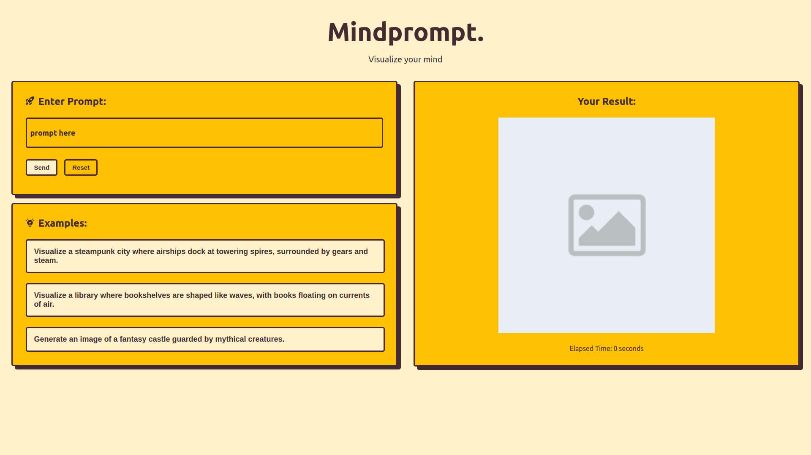

# Description

[Mindprompt](http://mindprompt-fahrialmd.vercel.app/) is a front end web application designed to help users visualize their thoughts. Key features include:

- **Prompt Input Field:** Users are greeted with a dedicated input field where they can effortlessly type in text-based prompts or thoughts they wish to visualize.
- **Machine Learning Integration:** Leveraging the power of the Hugging Face API, the application employs a sophisticated machine learning model to interpret user inputs and generate corresponding images.
- **Image Display:** Generated images are promptly displayed on the right side of the application, providing users with immediate visual feedback. The interface also showcases the elapsed time it took for the system to process the user's request.
- **Example Prompt Selection:** For added convenience and inspiration, users have the option to select from a curated list of example prompts offered by the application. This feature encourages exploration and creativity among users.

## Key Features:

- Text-based prompt input field.
- Integration with the Hugging Face API for image generation.
- Display of generated images along with the elapsed time.
- Option to select example prompts for visualization.

## Technologies Used:

- React framework for building the frontend.
- Hugging Face API for accessing machine learning models.
- HTML and CSS for styling and structuring the user interface.
- Vercel hosting.

## Preview
http://mindprompt-fahrialmd.vercel.app/

